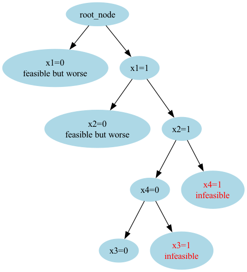

## Description
This repository contains the implementation of branch and bound algorithm for integer programs. The focus is not on efficiency but on the illustration and visualization of the algorithm.
The program uses Gurobi API to solve the LP relaxation. This may seem redundant as Gurobi itself can solve integer programs much more efficiently. However, the implementation prioritizes clarity and visualization 
of the algorithm over performance.

The comments in the code explain the procedure. Upon executing the `BnB.py` file, it will solve the mathematical program that is defined in `gurobi_solution.py` file and create a branch and bound tree. The tree also points out how the nodes are explored and pruned.

You can edit the problem definition in `gurobi_solution.py` file. Also, executing `gurobi_solution.py` shows the corresponding solution from Gurobi.

## Requirements

- `gurobipy 9.1.0` or higher to solve the LP relaxations
- `graphviz` for visualization

